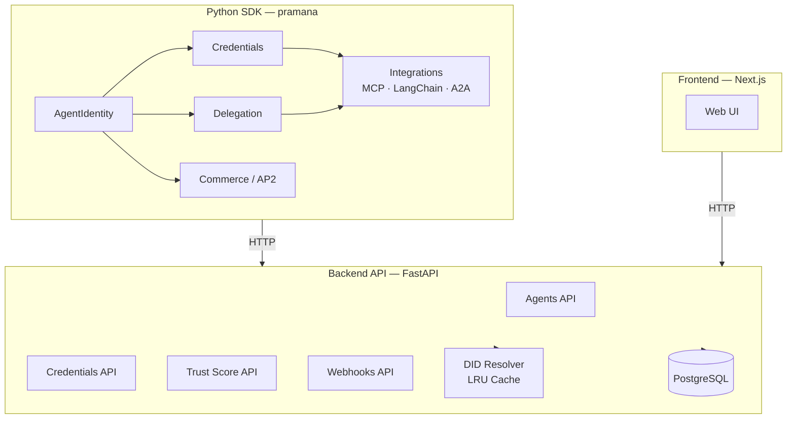
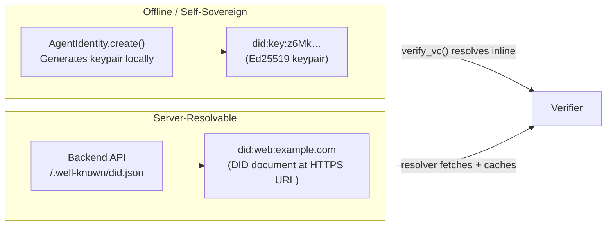
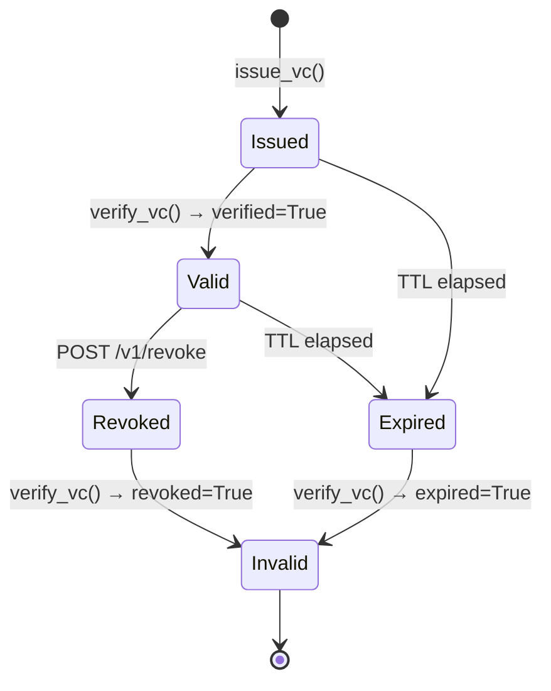
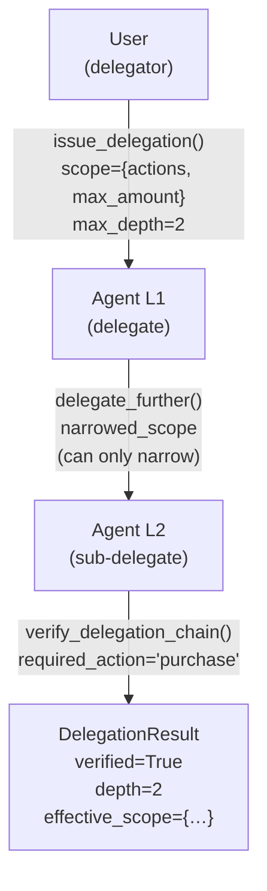
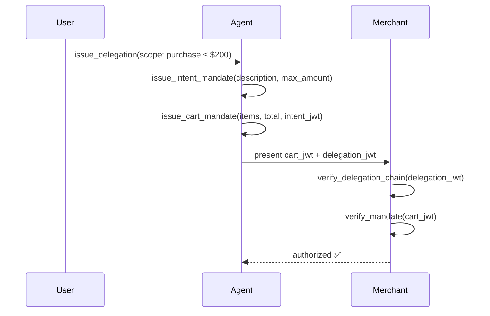
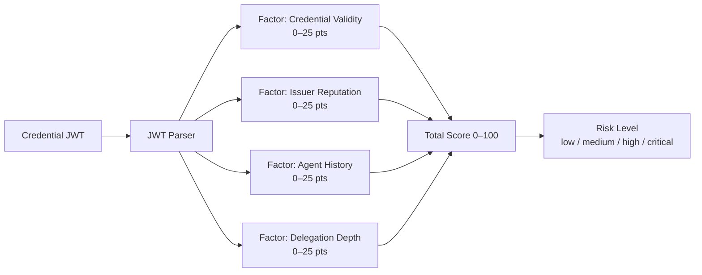
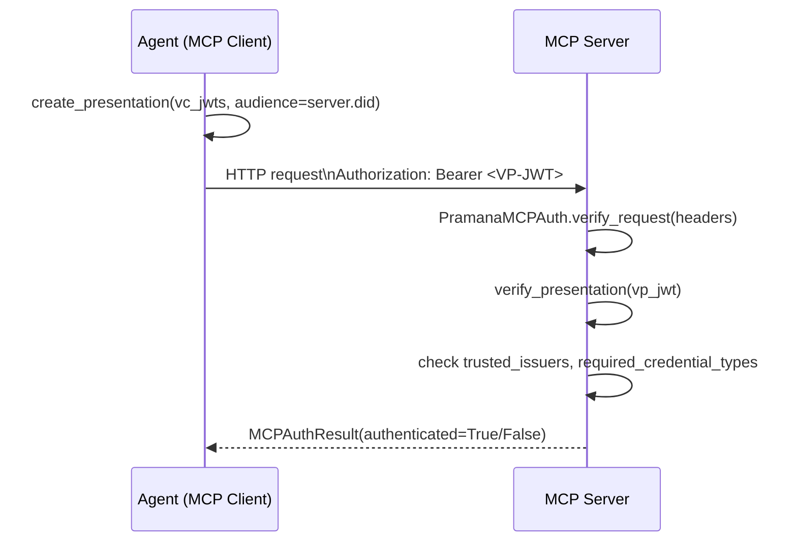

# Architecture — Pramana Protocol

## Overview

Pramana Protocol provides portable, cryptographically verifiable identities for AI agents. It is built on open W3C standards: Decentralized Identifiers (DIDs), Verifiable Credentials (VCs), and Verifiable Presentations (VPs).



## DID Methods

Pramana supports two DID methods with different trust models:



`did:key` DIDs embed the public key in the identifier itself — no network call is ever needed for verification. `did:web` DIDs are resolved via HTTPS, with a thread-safe LRU cache (TTL 300s, max 10,000 entries) in the backend.

## Credential Lifecycle



Credentials are signed VC-JWTs (EdDSA / Ed25519). Revocation uses a W3C Bitstring Status List — a compact, privacy-preserving mechanism where the credential references a bit index in a published status list.

## Delegation Chain Model



Key invariants enforced by the SDK:
- **Scope narrowing only** — child scope cannot exceed parent (`ScopeEscalationError`)
- **Depth limit** — `delegate_further` raises `ValueError` if `depth >= max_depth`
- **Expiry propagation** — expired parent immediately invalidates all children

## AP2 Mandate Flow



The AP2 (Agent Payment Protocol) layering means:
1. **Intent mandate** — captures the shopping goal (human-readable, budget ceiling)
2. **Cart mandate** — captures the specific transaction (merchant, items, total)

`issue_cart_mandate` enforces that `cart.total ≤ intent.max_amount` at issuance time.

## Trust Score Pipeline



Trust scores are computed on-demand by the backend (`POST /v1/trust/score`) and optionally recorded as `TrustEvent` records for historical trending.

## MCP Authentication Flow



## Repository Layout

```
pramana-protocol/
├── sdk/
│   ├── python/pramana/        ← Python SDK (no server dependency)
│   │   ├── identity.py
│   │   ├── credentials.py
│   │   ├── delegation.py
│   │   ├── commerce.py
│   │   └── integrations/
│   └── typescript/src/        ← TypeScript SDK
├── backend/                   ← FastAPI backend
│   ├── api/routes/
│   ├── core/                  ← settings, db, resolver, trust_score, webhooks
│   └── migrations/
├── frontend/                  ← Next.js web UI
├── scripts/                   ← Standalone demos + dev utilities
├── tests/
│   ├── synthetic/             ← Data generator
│   └── e2e/                   ← Full ecosystem tests
└── docs/
```
